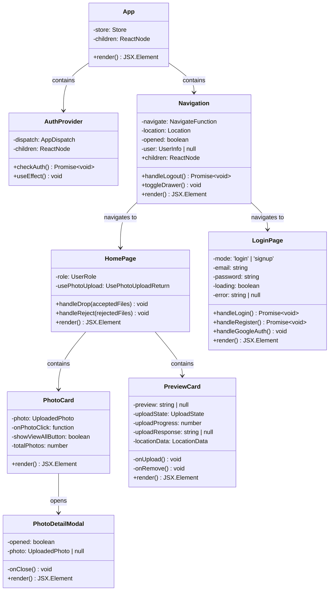
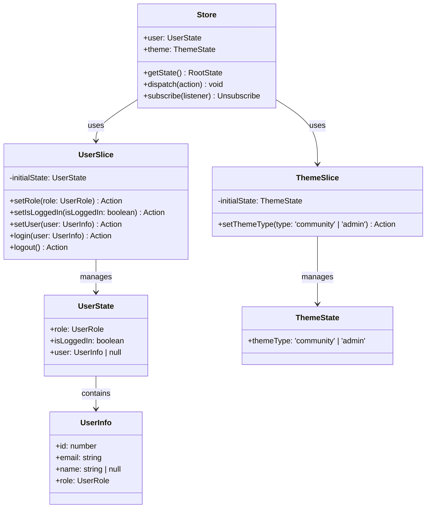
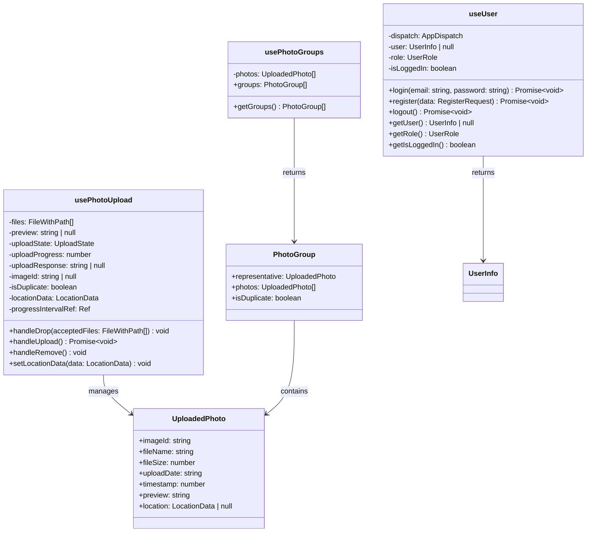
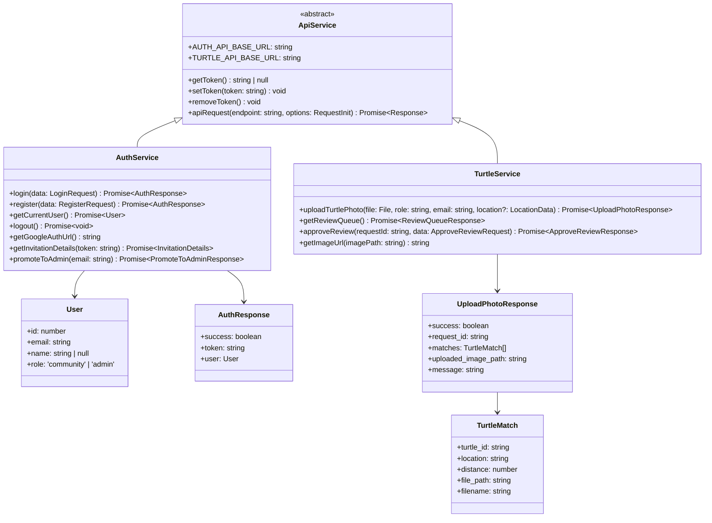
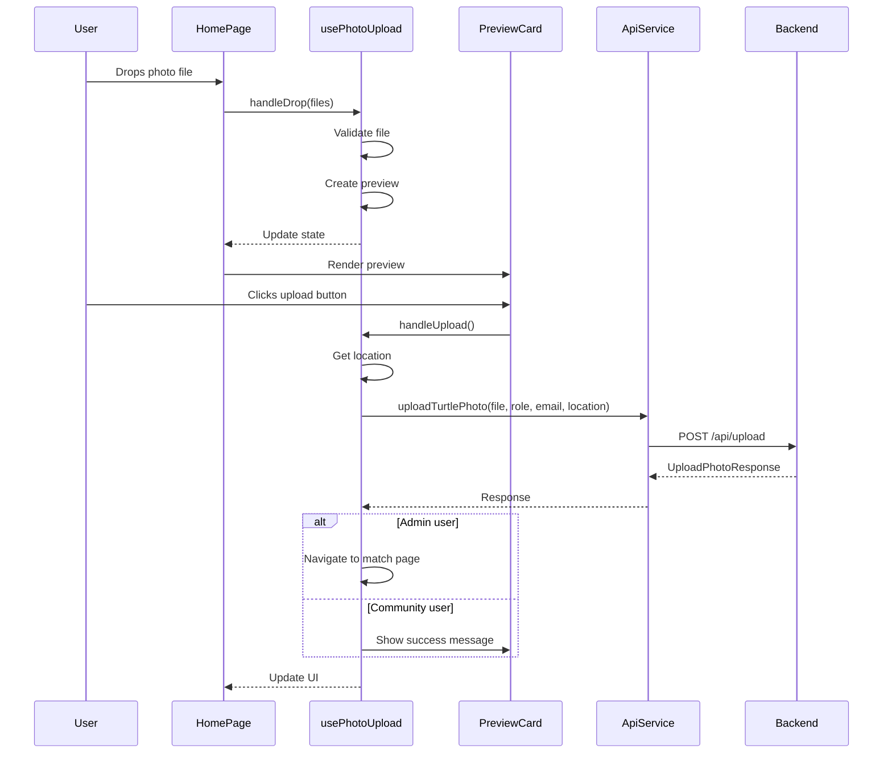
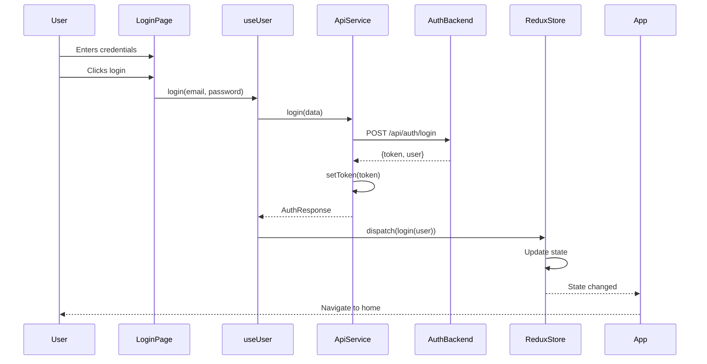
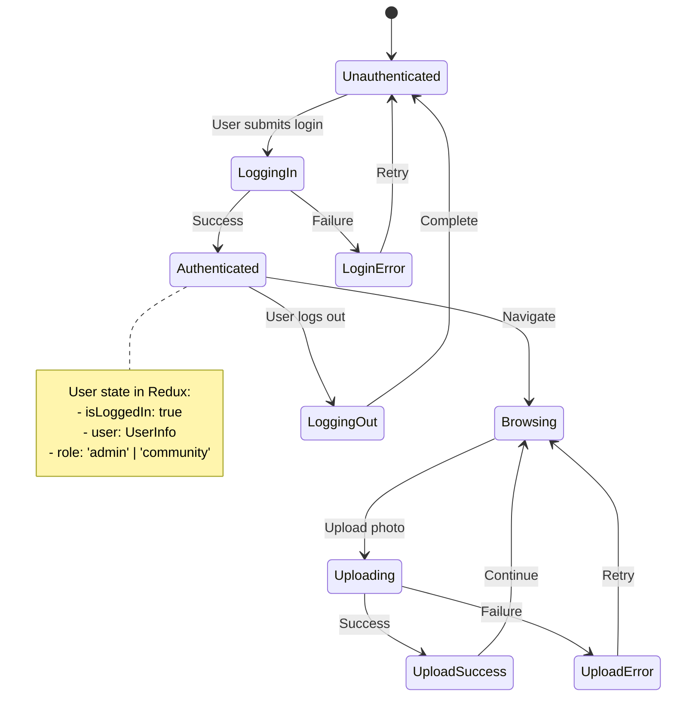
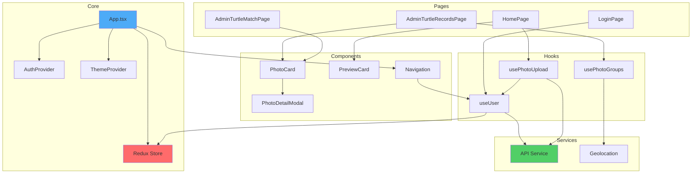

# UML Diagrams for Frontend

This document contains detailed UML diagrams for major components and classes. Team members can use these as references when creating their own diagrams.

## 1. Component Class Diagram - Detailed

## 2. Redux State Management - Detailed

## 3. Custom Hooks - Detailed

## 4. API Service Layer - Detailed

## 5. Component Interaction Sequence

## 6. Authentication Flow Sequence

## 7. State Management Flow

## 8. Component Dependency Graph

---

## Diagram Creation Guidelines

When creating your own diagrams, consider:

1. **Class Diagrams**: Focus on relationships, properties, and methods
2. **Sequence Diagrams**: Show the flow of interactions over time
3. **State Diagrams**: Represent state transitions and conditions
4. **Component Diagrams**: Show component hierarchy and dependencies
5. **Use Mermaid syntax**: All diagrams use Mermaid for easy rendering in Markdown

### Tools for Creating Diagrams

- **Mermaid Live Editor**: https://mermaid.live/
- **Draw.io**: https://app.diagrams.net/
- **PlantUML**: https://plantuml.com/
- **Lucidchart**: https://www.lucidchart.com/

### Best Practices

1. Keep diagrams focused on one aspect
2. Use consistent naming conventions
3. Show only relevant relationships
4. Include notes for complex flows
5. Update diagrams when code changes

