# Frontend Implementation Documentation

## Table of Contents
1. [Design Approach](#design-approach)
2. [Architecture Overview](#architecture-overview)
3. [Component Architecture](#component-architecture)
4. [State Management](#state-management)
5. [API Service Layer](#api-service-layer)
6. [Custom Hooks](#custom-hooks)
7. [Component Hierarchy](#component-hierarchy)
8. [Data Flow Diagrams](#data-flow-diagrams)

---

## Design Approach

### Overview
The frontend is built using **React 19** with **TypeScript**, following a modern component-based architecture. The application uses:

- **React Router** for client-side routing
- **Redux Toolkit** for state management
- **Mantine UI** for component library and theming
- **Custom Hooks** for reusable business logic
- **Service Layer** for API communication

### Key Design Principles

1. **Component-Based Architecture**: UI is broken down into reusable, composable components
2. **Separation of Concerns**: Clear separation between presentation (components), business logic (hooks), and data (services)
3. **Type Safety**: Full TypeScript coverage for better developer experience and fewer runtime errors
4. **State Management**: Centralized state with Redux for global state, local state for component-specific data
5. **Responsive Design**: Mobile-first approach with Mantine's responsive utilities
6. **Theme System**: Role-based theming (community vs admin) for visual distinction

### Technology Stack

- **Framework**: React 19.1.1
- **Language**: TypeScript 5.8.3
- **Build Tool**: Vite 7.1.7
- **State Management**: Redux Toolkit 2.9.2
- **Routing**: React Router DOM 7.9.4
- **UI Library**: Mantine 8.3.5
- **Icons**: Tabler Icons React 3.35.0
- **Testing**: Playwright 1.56.1

---

## Architecture Overview

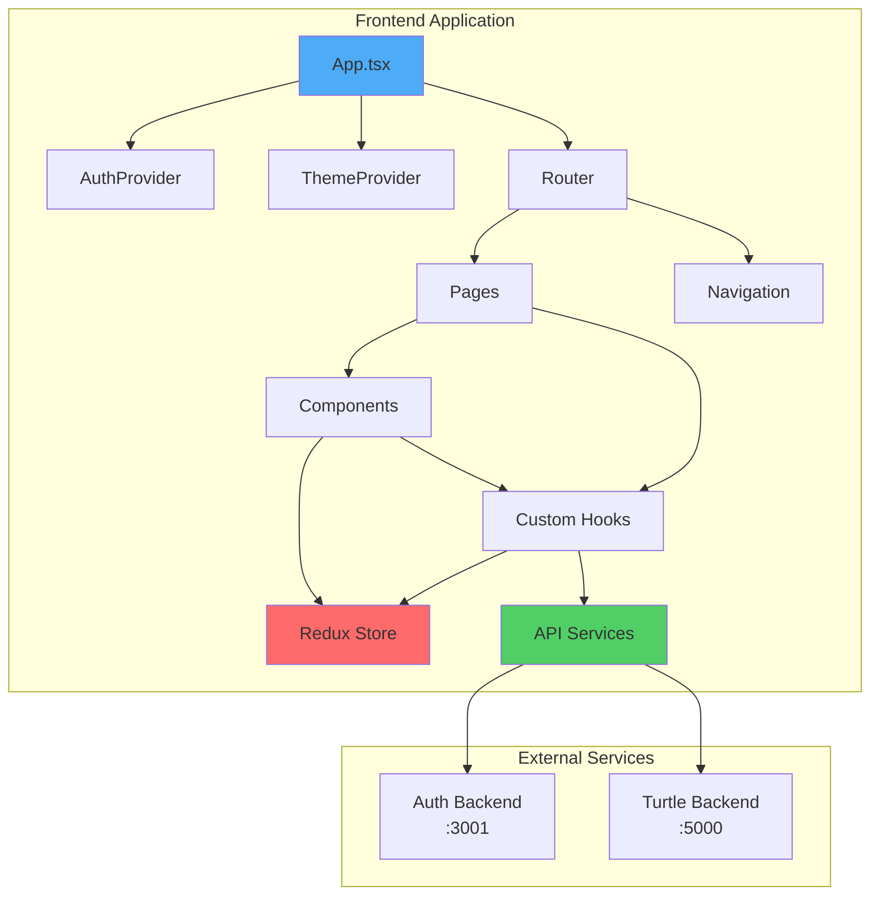

---

## Component Architecture

### Component Class Diagram

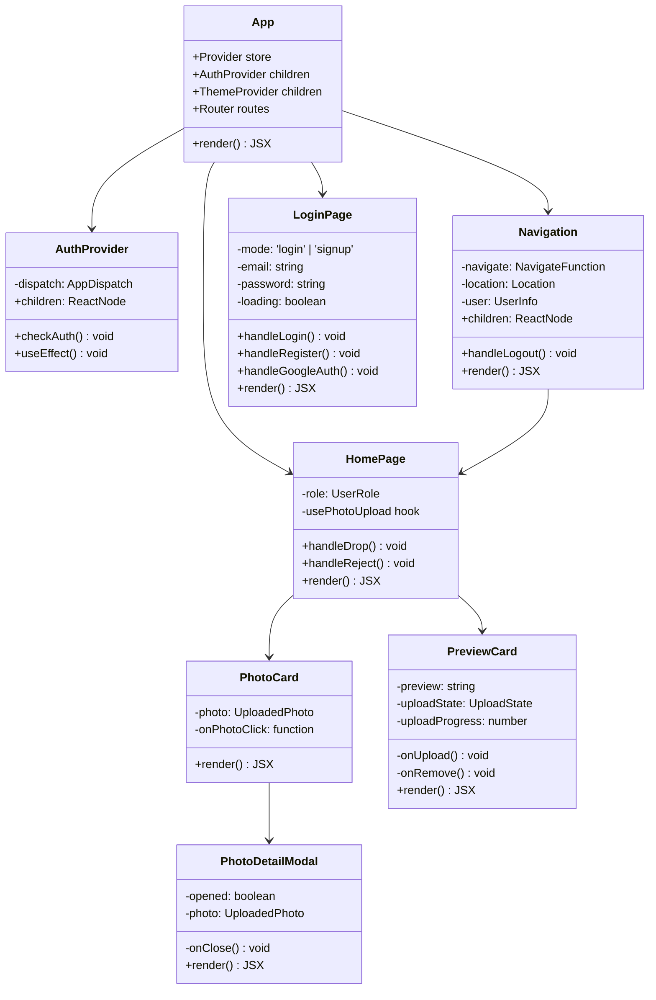

### Component Relationships

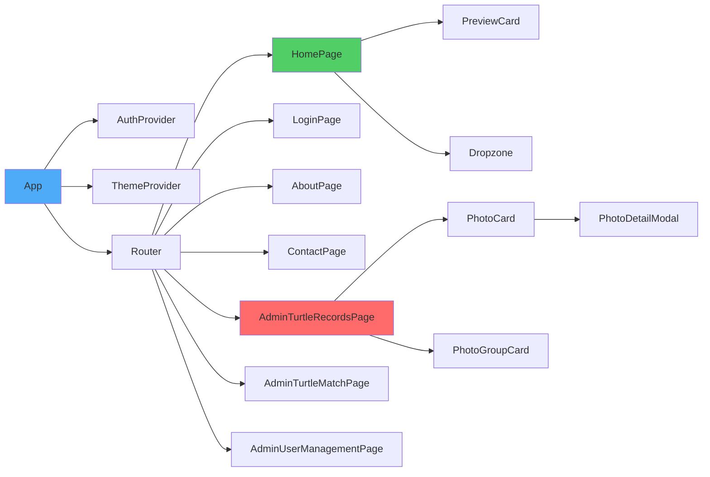

---

## State Management

### Redux Store Architecture

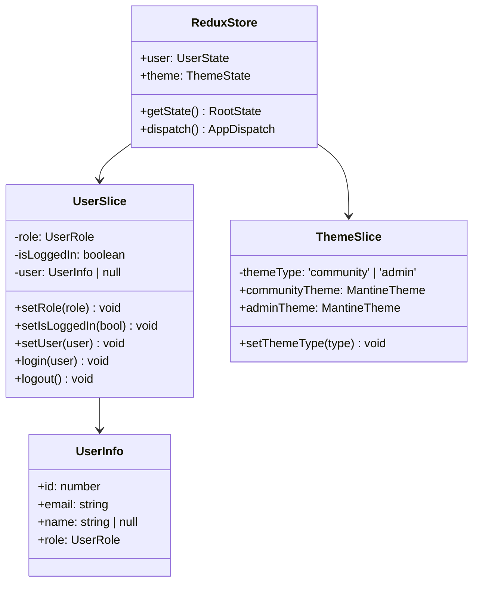

### State Flow Diagram

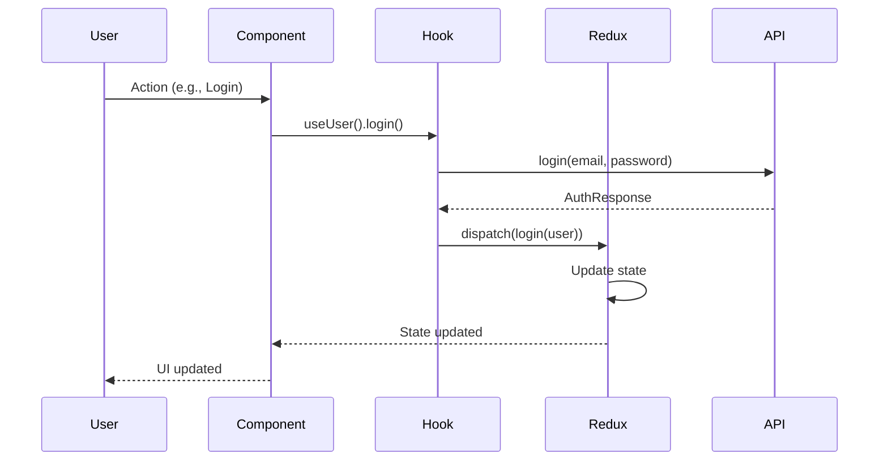

---

## API Service Layer

### API Service Class Diagram

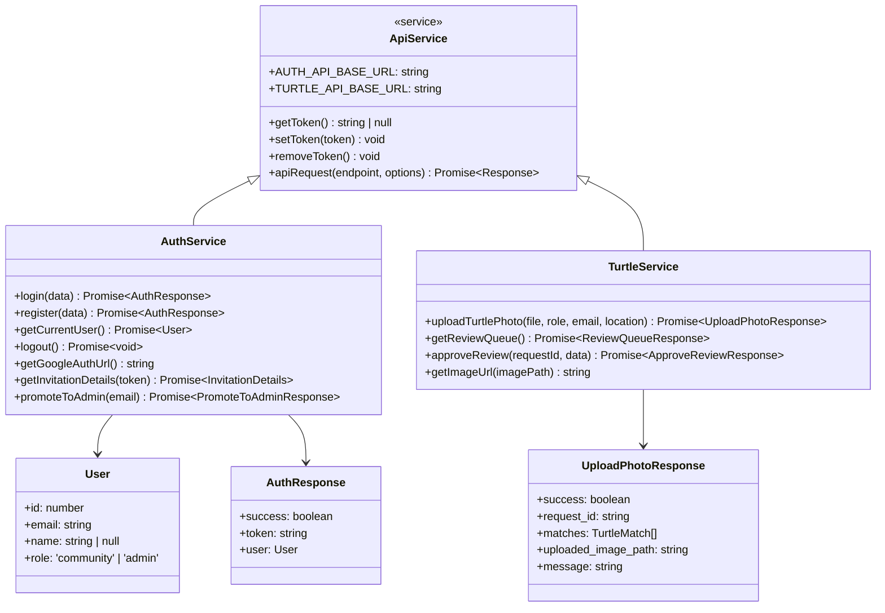

### API Request Flow

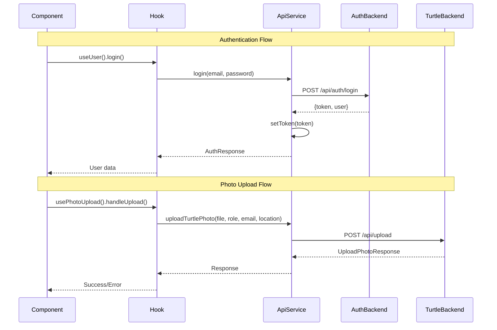

---

## Custom Hooks

### Custom Hooks Architecture

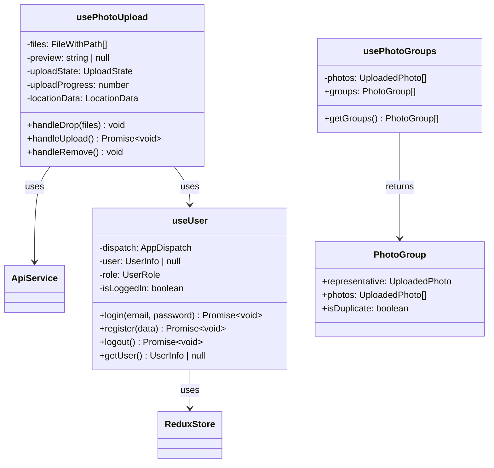

### Hook Dependencies

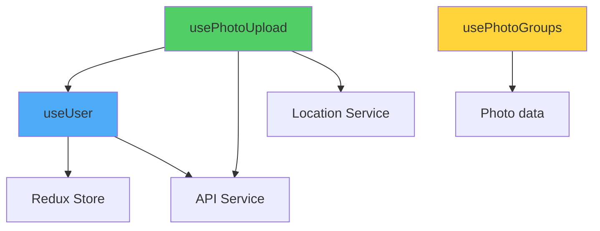

---

## Component Hierarchy

### Full Component Tree

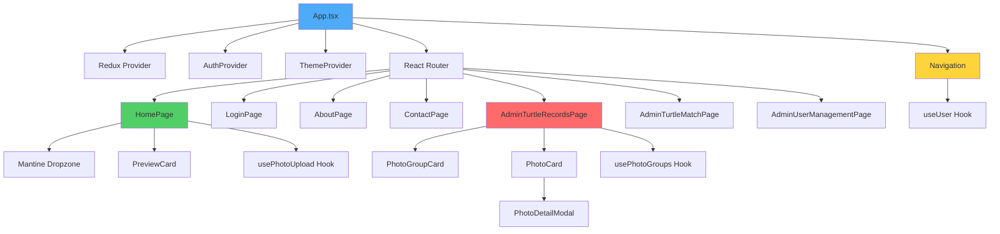

---

## Data Flow Diagrams

### Authentication Flow

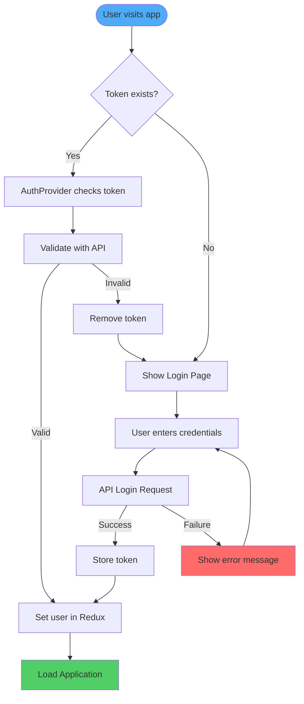

### Photo Upload Flow

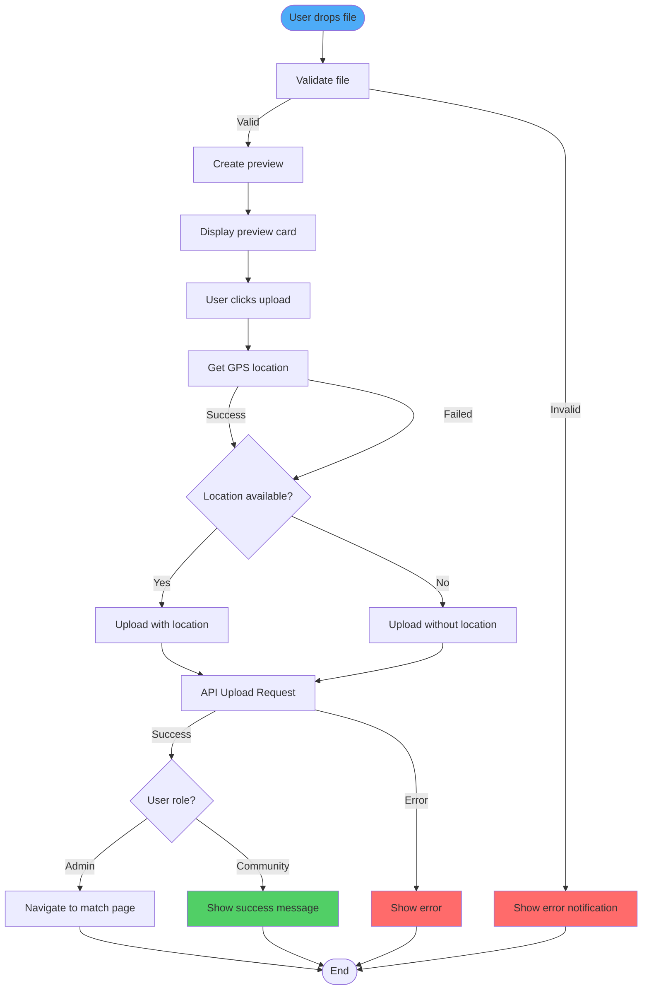

### State Management Flow

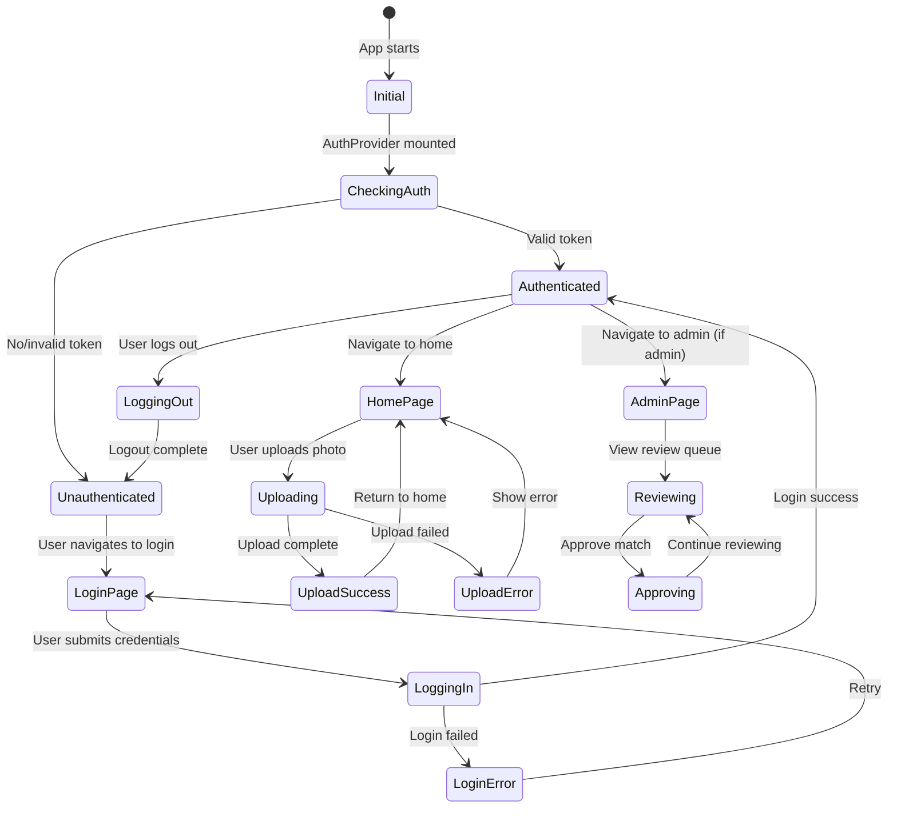

---

## File Structure

```
frontend/
├── src/
│   ├── components/          # Reusable UI components
│   │   ├── AuthProvider.tsx
│   │   ├── Navigation.tsx
│   │   ├── PhotoCard.tsx
│   │   ├── PhotoDetailModal.tsx
│   │   ├── PhotoGroupCard.tsx
│   │   └── PreviewCard.tsx
│   ├── hooks/               # Custom React hooks
│   │   ├── usePhotoGroups.ts
│   │   ├── usePhotoUpload.tsx
│   │   └── useUser.ts
│   ├── pages/               # Page components
│   │   ├── AboutPage.tsx
│   │   ├── AdminTurtleMatchPage.tsx
│   │   ├── AdminTurtleRecordsPage.tsx
│   │   ├── AdminUserManagementPage.tsx
│   │   ├── ContactPage.tsx
│   │   ├── HomePage.tsx
│   │   └── LoginPage.tsx
│   ├── services/            # API and service layer
│   │   ├── api.ts
│   │   └── geolocation.ts
│   ├── store/               # Redux store
│   │   ├── hooks.ts
│   │   ├── index.ts
│   │   └── slices/
│   │       ├── themeSlice.ts
│   │       └── userSlice.ts
│   ├── types/               # TypeScript type definitions
│   │   ├── User.ts
│   │   └── photo.ts
│   ├── utils/               # Utility functions
│   │   ├── fileValidation.ts
│   │   ├── imageCompression.ts
│   │   └── photoHelpers.ts
│   ├── App.tsx              # Root component
│   ├── main.tsx             # Entry point
│   └── index.css            # Global styles
├── tests/                   # Playwright tests
├── package.json
├── tsconfig.json
└── vite.config.ts
```

---

## Key Design Patterns

### 1. Provider Pattern
- **AuthProvider**: Wraps the app and handles authentication state restoration
- **ThemeProvider**: Provides role-based theming (community/admin)

### 2. Custom Hooks Pattern
- Encapsulates business logic and state management
- Promotes code reusability
- Examples: `useUser`, `usePhotoUpload`, `usePhotoGroups`

### 3. Service Layer Pattern
- Centralized API communication
- Token management
- Error handling

### 4. Redux Slice Pattern
- Modular state management
- Type-safe actions and reducers
- Examples: `userSlice`, `themeSlice`

### 5. Component Composition
- Small, focused components
- Props-based communication
- Reusable UI elements

---

## Summary

The frontend architecture follows modern React best practices with:

- **Clear separation of concerns** between components, hooks, and services
- **Type-safe** implementation with TypeScript
- **Centralized state management** with Redux Toolkit
- **Reusable business logic** through custom hooks
- **Consistent UI** with Mantine component library
- **Role-based theming** for different user types
- **Comprehensive error handling** and user feedback

This architecture ensures maintainability, scalability, and a good developer experience while providing a smooth user experience.

